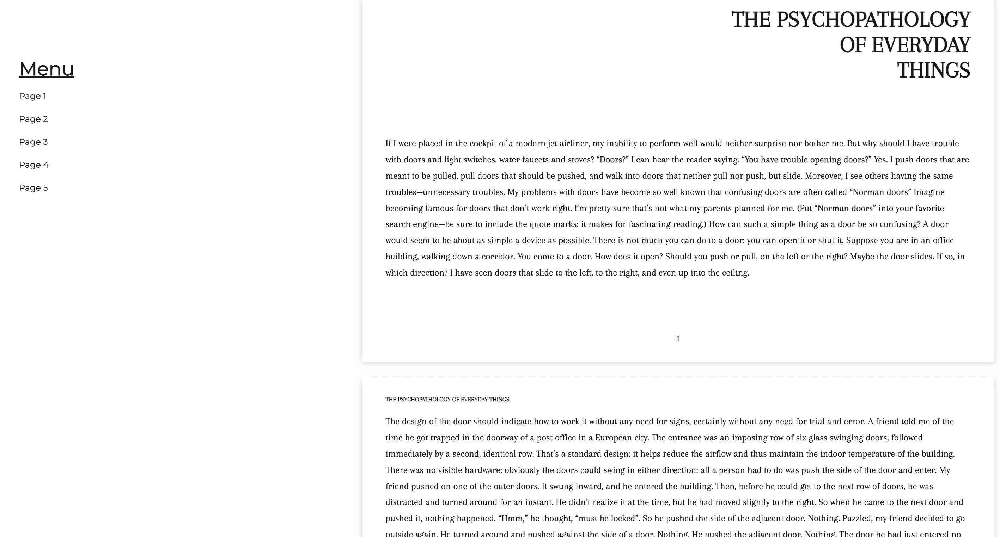

# Information Page

**Instructions**:

Use the text in the [text.md](./text.md) to create an informative website. 

**Rules**: 
* Work in the existing `index.html` and `style.css` files.
* Make sure to use semantic tags. In the markdown, page breaks are shown with `---`.
(You will need to read the text in order to markup it correctly.)
* Use the font 'Arapey'.
* Menu links should link to their respective sections.
* Avoid the use of deprecated HTML tags. 
* Create a website according to the design in the image below.

[//]: # (autograding info start)
#  Results
> ⌛ Give it a minute. As long as you see the orange dot  on top, CodeBuddy is still processing. Refresh this page to see it's current status.
>
> This is what CodeBuddy found when running your code. It is to show you what you have achieved and to give you hints on how to complete the exercise.

### HTML semantic structure

|                 Status                  | Check                                                                                    |
| :-------------------------------------: | :--------------------------------------------------------------------------------------- |
|  | HTML `doctype` should be declared |
|  | Document should contain `<head>` tag |
|  | Document should contain a `<title>` that's not empty |
|  | Document should contain a `<body>` tag |

### Font

|                 Status                  | Check                                                                                    |
| :-------------------------------------: | :--------------------------------------------------------------------------------------- |
|  | Page should use `Arapey` font |

### Navigation Menu

|                 Status                  | Check                                                                                    |
| :-------------------------------------: | :--------------------------------------------------------------------------------------- |
|  | Menu items should be aligned horizontally |
|  | Links on page should contain valid `href` attributes and redirect User to corresponding sections on page |

[🔬 Results Details](../../actions)
[🐞 Tips on Debugging](https://github.com/DCI-EdTech/autograding-setup/wiki/How-to-work-with-CodeBuddy)
[📢 Report Problem](https://docs.google.com/forms/d/e/1FAIpQLSfS8wPh6bCMTLF2wmjiE5_UhPiOEnubEwwPLN_M8zTCjx5qbg/viewform?usp=pp_url&entry.652569746=UIB-layout-webpage)

[//]: # (autograding info end)