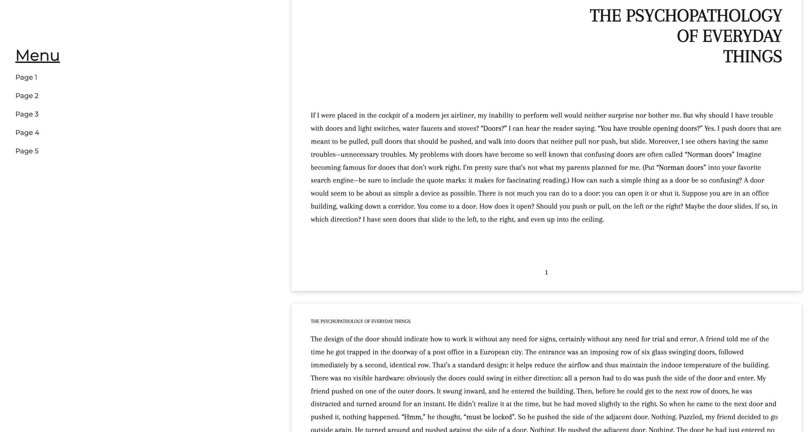

# Informationsseite

**Anweisungen**:

Verwende den Text in der [text.md](./text.md), um eine informative Website zu erstellen.

**Regeln**:
* Achte darauf, dass du semantische Tags verwendest. Im Markdown werden Seitenumbrüche mit `---` angezeigt.
(Du musst den Text lesen, um ihn richtig zu markieren.)
* Verwende die Schriftart Arapey.
* Erstelle eine Website, die dem Design der folgenden Abbildung entspricht.
* Das Menü sollte den Nutzer zur entsprechenden Seite im Journal führen.

